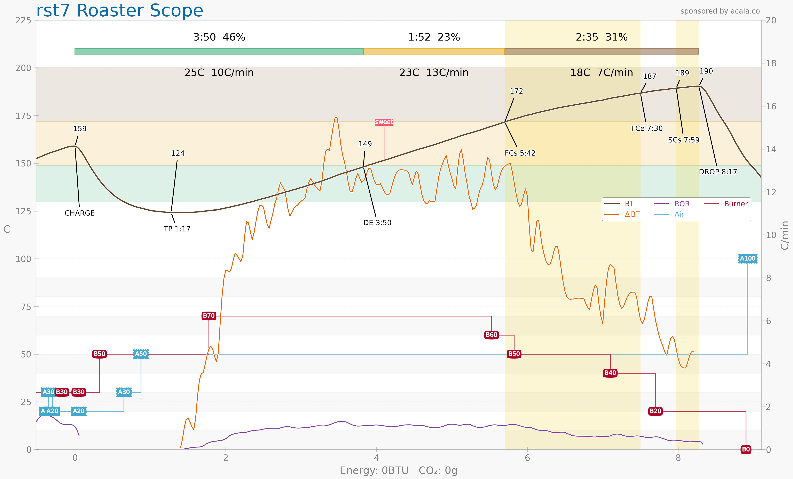
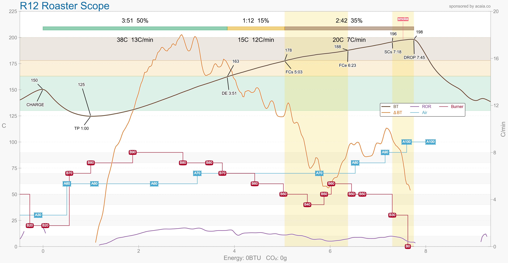

# coffee-roasting

coffee roasting logs and artisan config.

For a generic Skywalker/itop 500 gram coffee roaster, such as:
 - [https://www.amazon.com/dp/B0CYZY3FJD](https://www.amazon.com/dp/B0CYZY3FJD)

The Artisan Scope configuration file is based on the Artisan TC4 driver for skywalker roaster.
 - [https://github.com/jmoore52/SkywalkerRoaster](https://github.com/jmoore52/SkywalkerRoaster)

This repo keeps my config file and logs of coffee roasted.

## Roast Log

NOTE: (Roast # 1 - 6 are not available)

### Roast 7 - 9/20 Guatemala "dark"

### Roast 8 - 9/20 Guatemala "medium"

### Roast 9 - 9/20 Guatemala "light"

### Roast 11 - 9/21 Guatemala "dark 1"

### Roast 12 - 9/21 Guatemala "dark 2"

